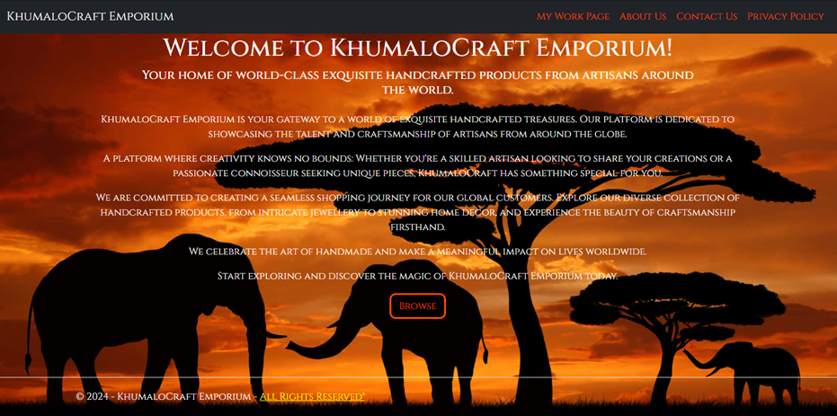
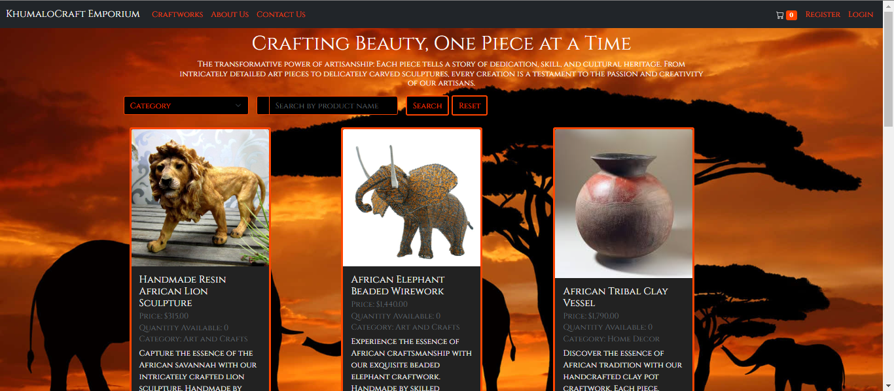
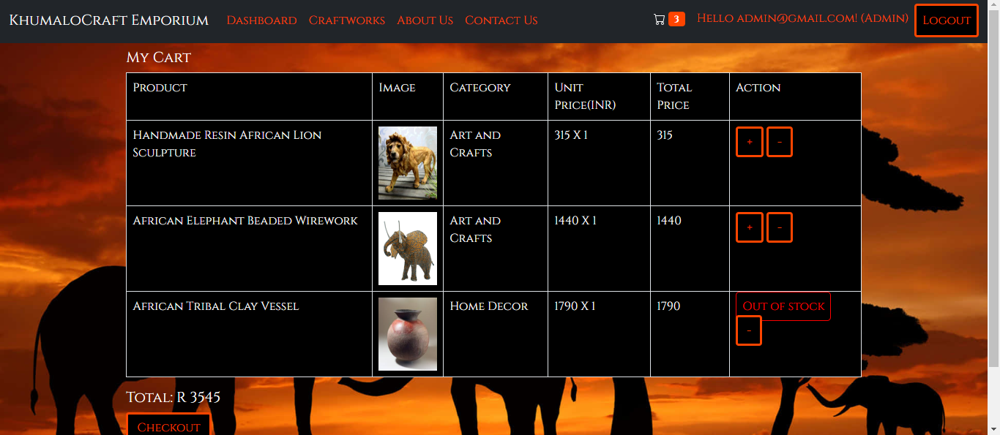
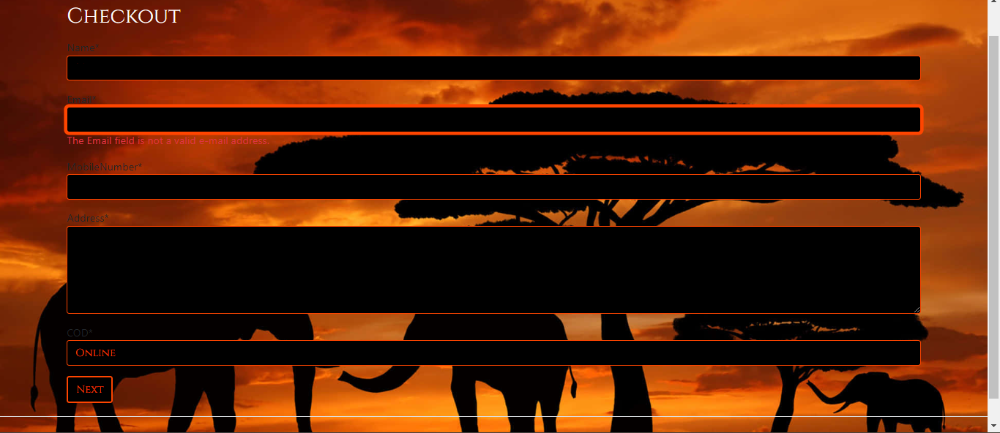
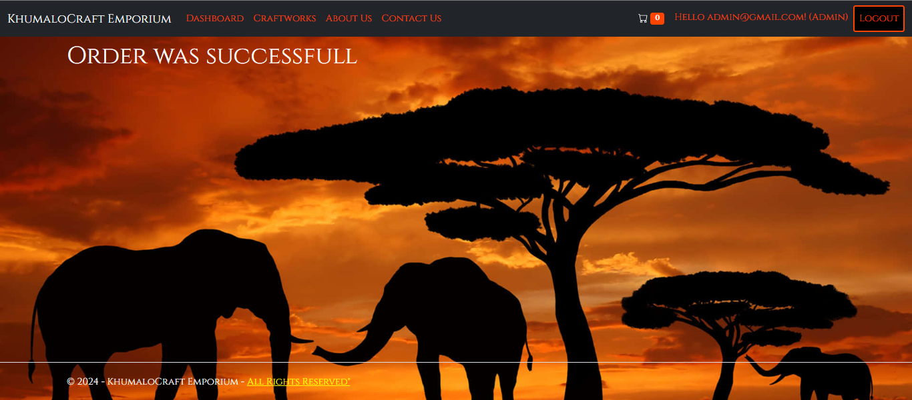
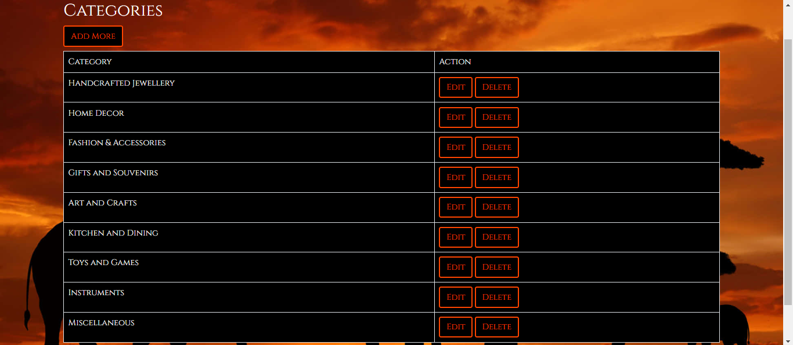
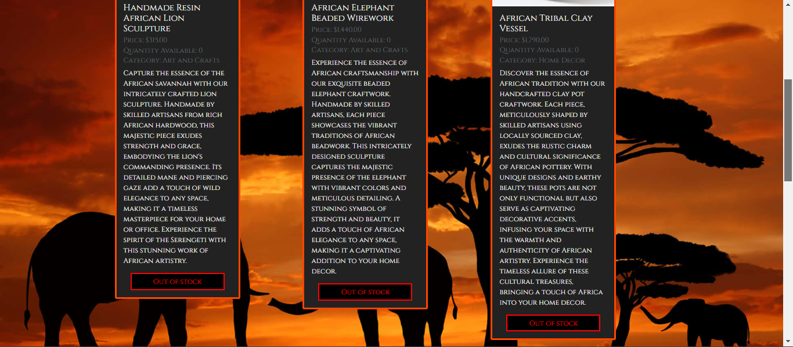

<div align="center">

<h1>⚡☁️ KhumaloCraft Emporium E-Commerce Site 🛒🛍️</h1>

</div>

---

## 📑 Table of Contents

✨ 1. [**Introduction**](#-1-introduction)<br>
💻 2. [**Setting Up the Project Locally**](#-2-setting-up-the-project-locally)<br>
✅ 3. [**Features and Functionality**](#-3-features-and-functionality)<br>
🖼️ 4. [**Screenshots**](#️-4-screenshots)<br>
🏗️ 5. [**Architecture**](#️-5-architecture)<br>
👥 6. [**Author and Contributions**](#-6-author-and-contributions)<br>
⚖️ 7. [**MIT License**](#️-7-mit-license)<br>
❓ 8. [**Frequently Asked Questions (FAQ)**](#-8-frequently-asked-questions-faq)<br>
📚 9. [**References**](#-9-references)<br>

---

## ✨ 1. Introduction

The **KhumaloCraft Emporium project** is a **comprehensive C# web application** developed to realize a global e-commerce platform for handcrafted products from artisans worldwide. The goal is to create a scalable, accessible, and user-friendly platform that connects artisans with customers globally, enabling them to access and order craftwork. The application is built using **ASP.NET MVC Core** and leverages **Microsoft Azure services** for deployment, database management, and advanced features. It includes essential informational pages—Home, About Us, Contact Us, and My Work—to advertise KhumaloCraft's services and showcase the available products. The development process focuses on demonstrating an understanding of cloud computing, designing an efficient database, and integrating advanced cloud functionalities to deliver a rich user experience.

### Technical Features:

- Web application developed using **ASP.NET**.
- Easily deployable on **Azure App Service** (Windows) for global accessibility.
- Integration with an **Azure SQL Database** to store user, product, and transaction data.
- Coordination of the order processing workflow (inventory update, payment processing, order confirmation) using **Azure Durable Functions**.

### Overview of Part 2 and Part 3 (KhumaloCraft E-Commerce)

The development of the **KhumaloCraft application** followed a staged approach, with **Part 2 and Part 3** representing key phases of added functionality.

**Part 2** focused on transforming the basic web application from Part 1 into a functional e-commerce backend by implementing data persistence and transaction capabilities. This involved designing and developing a SQL Server database to store user, product, and transaction-related data. The database was deployed on Azure, and its data was integrated into the web application's My Work page, replacing the initial static product details. Crucial features added in this part included allowing users to insert data via the web application, and enabling clients to place orders and view their previous orders, while KhumaloCraft users could see and process these orders.

**Part 3** enhanced the application with advanced Azure services to improve user experience and automation. The primary additions were the integration of Azure Durable Functions. Durable Functions were implemented to manage the complex, multi-step order processing workflow, automating tasks like inventory updates and notification sending using orchestrator and activity functions. Essentially, **Part 2 established the core transaction and data infrastructure**, and **Part 3 added intelligent search and streamlined workflow automation** using advanced serverless features. **No external API's or payment gateways** were included in either part of this application.

---

## 💻 2. Setting Up the Project Locally

### Prerequisites

To successfully compile and run this project, you must have the following installed on your system:

- **Operating Systems**: Any OS compatible with the .NET 8.0 Runtime and the corresponding SDK. This generally includes modern versions of Windows (Windows 10/11), macOS, or Linux distributions that support the .NET 8 framework.
- **IDE**: Compatible version of Microsoft Visual Studio (or an equivalent IDE like VS Code with extensions).
- **Version Control**: Git for cloning the repository.
- **Database**: SQL Server instance (either local or remote) is necessary to integrate with the main data store.
- **Frameworks**:
  - Target Framework: .NET 8.0 (net8.0)
  - Web Framework: ASP.NET Core 8.0
- **RAM**: Minimum 4GB
- **Disk Space**: Minimum 100MB free space
- **Dependencies**:
  - Microsoft.AspNetCore.Diagnostics.EntityFrameworkCore (Version 8.0.5)
  - Microsoft.AspNetCore.Identity.EntityFrameworkCore (Version 8.0.5)
  - Microsoft.AspNetCore.Identity.UI (Version 8.0.5)
  - Microsoft.EntityFrameworkCore.Sqlite (Version 8.0.4)
  - Microsoft.EntityFrameworkCore.SqlServer (Version 8.0.5)
  - Microsoft.EntityFrameworkCore.Tools (Version 8.0.5)
  - Microsoft.VisualStudio.Web.CodeGeneration.Design (Version 8.0.2)

### Project Configurations

#### `KhumaloCraft.csproj`

This configuration defines the project as an **ASP.NET Core web application** targeting the **latest framework version**.

```xml
<Project Sdk="Microsoft.NET.Sdk.Web">

  <PropertyGroup>
    <TargetFramework>net8.0</TargetFramework>
    <Nullable>enable</Nullable>
    <ImplicitUsings>enable</ImplicitUsings>
    <UserSecretsId>aspnet-KhumaloCraft-f0184988-1493-40b4-9150-1968be41b2d7</UserSecretsId>
  </PropertyGroup>

  <ItemGroup>
    <None Include="Views\AdminOperations\AllOrders.cshtml" />
    <None Include="Views\AdminOperations\Dashboard.cshtml" />
    <None Include="Views\AdminOperations\UpdateOrderStatus.cshtml" />
    <None Include="Views\AdminOperations\_OrderDetailModal.cshtml" />
    <None Include="Views\Craftwork\AddProduct.cshtml" />
    <None Include="Views\Craftwork\Index.cshtml" />
    <None Include="Views\Craftwork\UpdateProduct.cshtml" />
    <None Include="Views\Cart\Checkout.cshtml" />
    <None Include="Views\Cart\GetUserCart.cshtml" />
    <None Include="Views\Cart\OrderFailure.cshtml" />
    <None Include="Views\Cart\OrderSuccess.cshtml" />
    <None Include="Views\Category\AddCategory.cshtml" />
    <None Include="Views\Category\Index.cshtml" />
    <None Include="Views\Category\UpdateCategory.cshtml" />
    <None Include="Views\Stock\Index.cshtml" />
    <None Include="Views\Stock\ManangeStock.cshtml" />
    <None Include="Views\UserOrder\UserOrders.cshtml" />
    <None Include="wwwroot\js\site.js" />
    <None Include="wwwroot\lib\bootstrap\dist\css\bootstrap-grid.css.map" />
    <None Include="wwwroot\lib\bootstrap\dist\css\bootstrap-grid.min.css.map" />
    <None Include="wwwroot\lib\bootstrap\dist\css\bootstrap-grid.rtl.css.map" />
    <None Include="wwwroot\lib\bootstrap\dist\css\bootstrap-grid.rtl.min.css.map" />
    <None Include="wwwroot\lib\bootstrap\dist\css\bootstrap-reboot.css.map" />
    <None Include="wwwroot\lib\bootstrap\dist\css\bootstrap-reboot.min.css.map" />
    <None Include="wwwroot\lib\bootstrap\dist\css\bootstrap-reboot.rtl.css.map" />
    <None Include="wwwroot\lib\bootstrap\dist\css\bootstrap-reboot.rtl.min.css.map" />
    <None Include="wwwroot\lib\bootstrap\dist\css\bootstrap-utilities.css.map" />
    <None Include="wwwroot\lib\bootstrap\dist\css\bootstrap-utilities.min.css.map" />
    <None Include="wwwroot\lib\bootstrap\dist\css\bootstrap-utilities.rtl.css.map" />
    <None Include="wwwroot\lib\bootstrap\dist\css\bootstrap-utilities.rtl.min.css.map" />
    <None Include="wwwroot\lib\bootstrap\dist\css\bootstrap.css.map" />
    <None Include="wwwroot\lib\bootstrap\dist\css\bootstrap.min.css.map" />
    <None Include="wwwroot\lib\bootstrap\dist\css\bootstrap.rtl.css.map" />
    <None Include="wwwroot\lib\bootstrap\dist\css\bootstrap.rtl.min.css.map" />
    <None Include="wwwroot\lib\bootstrap\dist\js\bootstrap.bundle.js" />
    <None Include="wwwroot\lib\bootstrap\dist\js\bootstrap.bundle.js.map" />
    <None Include="wwwroot\lib\bootstrap\dist\js\bootstrap.bundle.min.js" />
    <None Include="wwwroot\lib\bootstrap\dist\js\bootstrap.bundle.min.js.map" />
    <None Include="wwwroot\lib\bootstrap\dist\js\bootstrap.esm.js" />
    <None Include="wwwroot\lib\bootstrap\dist\js\bootstrap.esm.js.map" />
    <None Include="wwwroot\lib\bootstrap\dist\js\bootstrap.esm.min.js" />
    <None Include="wwwroot\lib\bootstrap\dist\js\bootstrap.esm.min.js.map" />
    <None Include="wwwroot\lib\bootstrap\dist\js\bootstrap.js" />
    <None Include="wwwroot\lib\bootstrap\dist\js\bootstrap.js.map" />
    <None Include="wwwroot\lib\bootstrap\dist\js\bootstrap.min.js" />
    <None Include="wwwroot\lib\bootstrap\dist\js\bootstrap.min.js.map" />
    <None Include="wwwroot\lib\bootstrap\LICENSE" />
    <None Include="wwwroot\lib\jquery-validation-unobtrusive\jquery.validate.unobtrusive.js" />
    <None Include="wwwroot\lib\jquery-validation-unobtrusive\jquery.validate.unobtrusive.min.js" />
    <None Include="wwwroot\lib\jquery-validation\dist\additional-methods.js" />
    <None Include="wwwroot\lib\jquery-validation\dist\additional-methods.min.js" />
    <None Include="wwwroot\lib\jquery-validation\dist\jquery.validate.js" />
    <None Include="wwwroot\lib\jquery-validation\dist\jquery.validate.min.js" />
    <None Include="wwwroot\lib\jquery-validation\LICENSE.md" />
    <None Include="wwwroot\lib\jquery\dist\jquery.js" />
    <None Include="wwwroot\lib\jquery\dist\jquery.min.js" />
    <None Include="wwwroot\lib\jquery\dist\jquery.min.map" />
  </ItemGroup>

  <ItemGroup>
    <PackageReference Include="Microsoft.AspNetCore.Diagnostics.EntityFrameworkCore" Version="8.0.5" />
    <PackageReference Include="Microsoft.AspNetCore.Identity.EntityFrameworkCore" Version="8.0.5" />
    <PackageReference Include="Microsoft.AspNetCore.Identity.UI" Version="8.0.5" />
    <PackageReference Include="Microsoft.EntityFrameworkCore.Sqlite" Version="8.0.4" />
    <PackageReference Include="Microsoft.EntityFrameworkCore.SqlServer" Version="8.0.5" />
    <PackageReference Include="Microsoft.EntityFrameworkCore.Tools" Version="8.0.5" />
    <PackageReference Include="Microsoft.VisualStudio.Web.CodeGeneration.Design" Version="8.0.2" />
  </ItemGroup>

</Project>
```

#### `appsettings.json`

This configuration stores **connection strings**, **custom settings**, and **logging configuration**, which are loaded at runtime.

```json
{
  "ConnectionStrings": {},
  "Logging": {
    "LogLevel": {
      "Default": "Information",
      "Microsoft.AspNetCore": "Warning"
    }
  },
  "AllowedHosts": "*"
}
```

### Installation

Follow these steps to get the application running on your local machine.

#### 1. Clone the Repository

- Naviagte and click the green "**Code**" button at the top of this repository.
- Copy the URL under the "**HTTPS**" tab (`https://github.com/singhishkar/KhumaloCraft-E-Commerce.git`).
- Navigate to the directory where you want to save the project (e.g., `cd Documents/Projects`).
- Open your preferred terminal or command prompt and use the following command to clone the project:

```bash
git clone https://github.com/singhishkar/KhumaloCraft-E-Commerce.git
```

- This will create a new folder with the repository's name and download all the files and the entire history into it.
- Alternatively, you may download as a **ZIP file** or clone using **GitHub Desktop**.

#### 2. Open in Visual Studio (Recommended)

1.  Open **Visual Studio 2022**.
2.  Navigate to **File \> Open \> Project/Solution**.
3.  Browse to the cloned repository and select the **Solution file (.sln)** to load the project.
4.  Visual Studio will automatically perform a package restore (`dotnet restore`).

The application will launch. You should see a message in the console indicating the application is running. The browser should open automatically to the default URL.

#### 3. Configure Database Connection

The application connects to a **SQL database**. You must configure the connection string in the `appsettings.json` file. Create this file if it doesn't exist, and add the configuration using a placeholder structure.

> **Note**: If you are running locally, you will typically use a connection string pointing to a local SQL Server instance (e.g., using LocalDB).

`appsettings.json` Template (Use placeholder values):

```json
{
  "ConnectionStrings": {
    // Use a local SQL Server connection string for development
    "DefaultConnection": "Server=(localdb)\\mssqllocaldb;Database=KhumaloCraftDB;Trusted_Connection=True;MultipleActiveResultSets=true"
  },
  // You must provide real credentials here to connect to Azure services
  "AzureSettings": {
    "DurableFunctionsBaseUri": "YOUR_DURABLE_FUNCTIONS_BASE_URI",
    "DurableFunctionsAppKey": "YOUR_DURABLE_FUNCTIONS_HOST_KEY"
  },
  "Logging": {
    // ... (standard logging settings)
  },
  "AllowedHosts": "*"
}
```

#### 4. Apply Database Migrations

Use the **Entity Framework Core tools** to create the database schema based on the code's models. Run these commands from the main project directory (`KhumaloCraft`):

```bash
# Update the database to the latest migration
dotnet ef database update
```

This command will create the `KhumaloCraftDB` database (if it doesn't exist) and apply all necessary tables for **Identity, Products, Orders, etc.**

### Running

#### 1. Run in Visual Studio

1.  Select **Build \> Build Solution** (or press `F6`) to compile the project.
2.  Click the **Run** button (or press `F5`) to start the application with debugging, or `Ctrl+F5` to start without debugging.

#### 2. Run via Command Line (Alternative)

If you are using **Visual Studio Code** or prefer the CLI:

1.  Navigate to the project directory containing the `.csproj` file.
2.  Execute the following commands in sequence:

```bash
# Clean up any previous build files
dotnet clean

# Restore project dependencies
dotnet restore

# Build and run the application
dotnet run
```

#### 4. Access the Application

- The console output will indicate the local URL where the application is hosted (e.g., `https://localhost:7198`).
- Open your web browser and navigate to the displayed URL (e.g., `https://localhost:7198`). You should now see the **KhumaloCraft Emporium home page**.

#### Note: Using Azure Features

- To test the **Order Processing Workflow** via **Azure Durable Functions**, the `AzureSettings` must contain valid URIs and keys for your deployed **Azure Functions App**. Without these, the associated features (**like full-text search and order fulfillment**) will not work correctly.

---

## ✅ 3. Features and Functionality

### Data Management and Persistence

- **Database System**: Utilizes a SQL Server database to store all application data.
- **Data Entities**: The database is structured to store necessary entities, including:
  - User-related data.
  - Product-related data.
  - Transaction-related data.
- **Dynamic Data Display**: Dynamically retrieves and displays craftwork details from the database, replacing the initial static content.
- **Product Information Display**: Displays key product information, including the product name, price, category, and availability.
- **Data Insertion (Administrative)**: Users can insert new data (related to products, categories, etc.) into the SQL database directly through the web application interface

### User & Customer Functionality

- **User Identity**: Includes **ASP.NET Core Identity** for secure user authentication, registration, and authorization (required for user, client, and KhumaloCraft users).
- **Client Ordering**: Clients have the ability to place orders for a craftwork they wish to purchase. (simulated)

### Administrative and E-commerce Workflow

- **Order Visibility**: KhumaloCraft administrators are able to see stock inventory orders.
- **Order Processing**: KhumaloCraft users are able to process client orders.

### Advanced Azure Services Integration (Part 3)

- **Azure Durable Functions** (Order Workflow Automation): Implements a serverless function workflow to manage multi-step processes.
  - **Orchestrator Function**: Coordinates the different, complex steps in the order processing workflow (e.g., inventory updates, payment, confirmation).
  - **Inventory Management**: An activity function is dedicated to inventory-related tasks, ensuring the inventory is updated immediately after an order is placed.
  - **Notification Workflow**: Orchestrator manages the notification workflow using activity functions.

---

## 🖼️ 4. Screenshots

|                  Heading                   |                                                 Description                                                 |                          Image / Screenshots                          |
| :----------------------------------------: | :--------------------------------------------------------------------------------------------------------- | :-------------------------------------------------------------------: |
|           **Welcome/Home Page**            |                              Welcomes user to the site and browse to products.                              |                                     |
|       **My Work Page/Products Page**       |                                    List of available products or items.                                     |              |
|         **Products Continued...**          |                             Scrollable view showing remaining product listings.                             |                        |
|          **Adding Items To Cart**          |                                   Users cart after adding items to cart.                                    |                          |
|            **Checkout Details**            |  Users input checkout details (name, email, cell number, address, purchase type) before confirming order.   |                          |
|        **Order Successful Message**        |           The confirmation screen displayed to the user after a successful purchase transaction.            |           |
| **CRUD functionality (Admin): Categories** | Admin interface showing the ability to **C**reate, **R**ead, **U**pdate, and **D**elete product categories. |  |
|  **Stock/Inventory Updated in real time**  |   Products page highlighting the dynamic display of product stock levels following a purchase or update.    |     |

---

## 🏗️ 5. Architecture

### Application Structure (ASP.NET Core MVC)

The application code adheres to the **MVC pattern**, which ensures a clear separation of concerns, making the codebase maintainable, testable, and scalable.

- **Model**: This layer manages the application's data and business logic. It includes the Entity Framework Core data context, the entity classes (e.g., Product, Order), and the service classes responsible for interacting with the database and external Azure APIs.
- **View**: The user interface (UI) is rendered using Razor views. This layer is responsible solely for presenting the data to the client and capturing user input.
- **Controller**: Controllers act as the entry point for handling user requests. They receive input, coordinate the necessary actions by calling methods in the Model layer, and determine which View to return to the user.

---

## 👥 6. Author and Contributions

### Primary Developer:

- I, **_Ishkar Singh_**, am the sole developer and author of this project:
  Email (for feedback or concerns): **ishkar.singh.108@gmail.com**

### Reporting Issues:

- If you encounter any bugs, glitches, or unexpected behaviour, please open an Issue on the GitHub repository.
- Provide as much detail as possible, including:
  - Steps to reproduce the issue
  - Error messages (if any)
  - Screenshots or logs (if applicable)
  - Expected vs. actual behaviour
- Clear and descriptive reports help improve the project effectively.

### Proposing Enhancements:

- Suggestions for improvements or feature enhancements are encouraged.
- You may open a Discussion or submit an Issue describing the proposed change.
- All ideas will be reviewed and considered for future updates.

---

## ⚖️ 7. MIT License

**Copyright © 2025 KhumaloCraft E-Commerce**<br>
**Copyright © 2025 KhumaloCraft**<br>

Permission is hereby granted, free of charge, to any person obtaining a copy of this software and associated documentation files (the "Software"), to deal
in the Software without restriction, including without limitation the rights to use, copy, modify, merge, publish, distribute, sublicense, and/or sell copies of the Software, and to permit persons to whom the Software is furnished to do so, subject to the following conditions:

The above copyright notice and this permission notice shall be included in all copies or substantial portions of the Software.

THE SOFTWARE IS PROVIDED "AS IS", WITHOUT WARRANTY OF ANY KIND, EXPRESS OR IMPLIED, INCLUDING BUT NOT LIMITED TO THE WARRANTIES OF MERCHANTABILITY, FITNESS FOR A PARTICULAR PURPOSE AND NONINFRINGEMENT. IN NO EVENT SHALL THE AUTHORS OR COPYRIGHT HOLDERS BE LIABLE FOR ANY CLAIM, DAMAGES OR OTHER LIABILITY, WHETHER IN AN ACTION OF CONTRACT, TORT OR OTHERWISE, ARISING FROM, OUT OF OR IN CONNECTION WITH THE SOFTWARE OR THE USE OR OTHER DEALINGS IN THE SOFTWARE.

---

## ❓ 8. Frequently Asked Questions (FAQ)

## Frequently Asked Questions (FAQ) ❓

### 1. What is KhumaloCraft Emporium?

**KhumaloCraft Emporium** is an internationally accessible e-commerce platform designed to exhibit, promote, and facilitate the sale of **handcrafted products** created by **artisans** from various regions around the world. The platform aims to empower artisans by providing them with a secure, user-friendly digital marketplace through which they can reach a global customer base. It also offers customers a curated catalog of unique, culturally diverse, and ethically sourced handmade items.

### 2. Is the platform stable and scalable for growth?

**Yes**. The application is developed using **ASP.NET Core**, a high-performance, cross-platform web framework known for its reliability and efficiency. It is intended to be deployed on **Microsoft Azure App Service**, which offers enterprise-grade hosting capabilities. This architecture supports automatic scaling, load balancing, and continuous availability, ensuring that the platform remains stable under increased traffic and can seamlessly accommodate future expansion in both users and product offerings.

### 3. Does placing an order affect inventory immediately?

**Yes**. Once an order is placed, the system triggers a dedicated activity function within an **Azure Durable Functions workflow**. This workflow is responsible for executing all inventory-related operations in a consistent and controlled manner. As part of this process, the platform immediately adjusts the inventory count to reflect the items purchased, ensuring real-time accuracy and preventing potential overselling.

### 4. Can the application be run without an Azure account?

**Partially**. While the core web application **can run locally without an Azure subscription, several essential features depend on Azure services**. Functionality such as, Azure Functions, and other cloud-hosted components cannot be fully replicated without an Azure account. As a result, the application will operate with limited capability when these cloud resources are unavailable.

### 5. What software and knowledge do I need to run the KhumaloCraft-E-Commerce locally?

To run the **KhumaloCraft-E-Commerce** locally, you'll need:

- **Visual Studio 2019 or later** installed on your system.
- **.NET Core 8 or later**.
- **Basic knowledge of the C# programming language**.

### 6. What steps should I take if the application becomes unresponsive?

If the application becomes unresponsive or freezes, try the following actions:

1. **Close and relaunch the application**:

   - This resolves most **temporary UI freezes** or non-critical memory handling issues.

2. **Check system resource usage**:

   - Open the **Task Manager** (Windows: `Ctrl + Shift + Esc`) and verify whether your system is experiencing high **CPU, memory, or disk usage**.
   - Look for any **background processes**—especially **.NET applications** or heavy programs—that may be interfering with the app’s performance.

3. **Confirm your system meets requirements**:

   - Ensure your device meets the **minimum runtime requirements** for the application, including the correct version of **.NET**.

4. **Restart your system if needed**:
   - If the application continues to freeze, performing a **full system restart** may help clear locked processes or resource conflicts.

- If the issue persists after these steps, please submit a **detailed report** via the **GitHub Issues page**.

### 7. How can I check for available updates or update the application?

To stay up to date with the latest features, bug fixes, and improvements:

1. **Visit the GitHub repository**:

   - Navigate to the project’s main **GitHub page** and check the **Releases section** for new versions.

2. **Download the latest release**:

   - Each release includes **updated binaries or source code**. Download the version appropriate for your setup.

3. **Replace outdated application files**:

   - If you manually installed the application, **replace your existing files** with the new versions.
   - If working with source code, **pull the latest changes** and **rebuild the solution**.

4. **Read the release notes**:
   - **Release notes** often include details on new features, breaking changes, migration steps, and resolved issues.

### 8. How should I report a bug or unexpected application behaviour?

1. Thank you for helping improve the application. To report a bug:

   - **Open an Issue on GitHub**: Go to the repository’s **Issues tab** and **create a new issue**.

2. **Provide detailed information**:

- Include, where possible:

  - A **clear description** of the problem
  - **Step-by-step instructions** on how to reproduce the issue
  - **Expected behavior vs. actual behavior**
  - **Screenshots, console output, or error logs** (if applicable)
  - Your **system information** (operating system, .NET version, etc.)

3. **Use clear and descriptive titles**:
   - This helps **categorize and prioritize issues** efficiently.
   - The more detail provided, the easier it will be to diagnose and resolve the problem.

### 9. What should I do if the application fails to launch?

If the application fails to start, consider the following troubleshooting steps:

1. **Verify .NET Framework installation**:

   - Ensure that **.NET Framework 8** is installed on your system.
   - You may download the required runtime from **Microsoft’s official website** if necessary.

2. **Check the build integrity** (for source code users):

   - If running from the source code, ensure that the project **builds successfully** in your IDE with **no compilation errors**.
   - Confirm that all project dependencies and **NuGet packages** are properly **restored**.

3. **Ensure file integrity**:

   - Make sure no essential application files are **missing or corrupted**. If unsure, **re-download the application or clone the repository again**.

4. **Run as administrator** (if required):

   - Certain systems may restrict application execution. Right-click the executable and select **Run as administrator**.

5. **Verify `launchSettings.json` and `appsettings.json`**:
   - Check the `launchSettings.json` file and ensure the correct application URL and launch profile are configured. Review `appsettings.json` to confirm that all required configuration keys, especially those for connection strings and API endpoints, are present and hold valid values.

- If the application still does not launch, please **report the issue through GitHub** with system details and any error messages received.

---

## 📚 9. References

- **Azure, n.d. Azure SDK for .NET.** [online] _[github.com](https://github.com/Azure/azure-sdk-for-net/)_ [Accessed 12 April 2024].
- **BroCode, n.d. C# for Beginners.** [online] _[youtube.com](https://www.youtube.com/watch?v=4BwyqmRTrx8)_ [Accessed 3 May 2024].
- **BroCode, n.d. C# Full Course.** [online] _[youtube.com](https://www.youtube.com/watch?v=T_zSVIsTEZU)_ [Accessed 15 April 2024].
- **CodePen, n.d. Nikki Peel – RwavQer.** [online] _[codepen.io](https://codepen.io/nikki-peel/pen/RwavQer)_ [Accessed 28 May 2024].
- **Microsoft Docs, n.d. Add User Data – ASP.NET Core Authentication.** [online] _[learn.microsoft.com](https://learn.microsoft.com/en-us/aspnet/core/security/authentication/add-user-data?view=aspnetcore-5.0&tabs=visual-studio)_ [Accessed 11 June 2024].
- **Microsoft Docs, n.d. ASP.NET Core Fundamentals – Static Files.** [online] _[learn.microsoft.com](https://learn.microsoft.com/en-us/aspnet/core/fundamentals/static-files?view=aspnetcore-8.0)_ [Accessed 2 April 2024].
- **Microsoft Docs, n.d. Azure Blob Storage Overview.** [online] _[learn.microsoft.com](https://learn.microsoft.com/azure/storage/blobs/)_ [Accessed 7 May 2024].
- **Microsoft Docs, n.d. Azure Functions Overview.** [online] _[learn.microsoft.com](https://learn.microsoft.com/azure/azure-functions/)_ [Accessed 10 May 2024].
- **Microsoft Docs, n.d. Create Your First Azure Function (Visual Studio).** [online] _[learn.microsoft.com](https://learn.microsoft.com/en-us/azure/azure-functions/functions-create-your-first-function-visual-studio)_ [Accessed 20 June 2024].
- **Microsoft Docs, n.d. First MVC App Tutorial.** [online] _[learn.microsoft.com](https://learn.microsoft.com/en-us/aspnet/core/tutorials/first-mvc-app/start-mvc?view=aspnetcore-8.0&tabs=visual-studio)_ [Accessed 9 May 2024].
- **Microsoft Docs, n.d. Razor Pages Tutorial.** [online] _[learn.microsoft.com](https://learn.microsoft.com/en-us/aspnet/core/tutorials/razor-pages/razor-pages-start?view=aspnetcore-8.0&tabs=visual-studio)_ [Accessed 16 April 2024].
- **Microsoft Docs, n.d. Roles in ASP.NET Core Authorization.** [online] _[learn.microsoft.com](https://learn.microsoft.com/en-us/aspnet/core/security/authorization/roles?view=aspnetcore-8.0)_ [Accessed 29 April 2024].
- **Microsoft Docs, n.d. What is Azure Cognitive Search?** [online] _[learn.microsoft.com](https://learn.microsoft.com/en-us/azure/search/search-what-is-azure-search)_ [Accessed 8 June 2024].
- **YouTube, n.d. Authentication Tutorial.** [online] _[youtube.com](https://www.youtube.com/watch?v=qvsWwwq2ynE)_ [Accessed 14 May 2024].
- **YouTube, n.d. Authorization Roles Tutorial.** [online] _[youtube.com](https://www.youtube.com/watch?v=ghzvSROMo_M)_ [Accessed 1 June 2024].
- **YouTube, n.d. Azure Search Overview.** [online] _[youtube.com](https://www.youtube.com/watch?v=g15mF_XAOB8&t=309s)_ [Accessed 24 June 2024].
